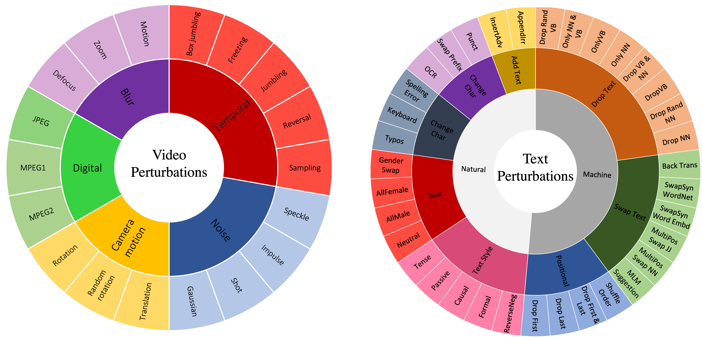
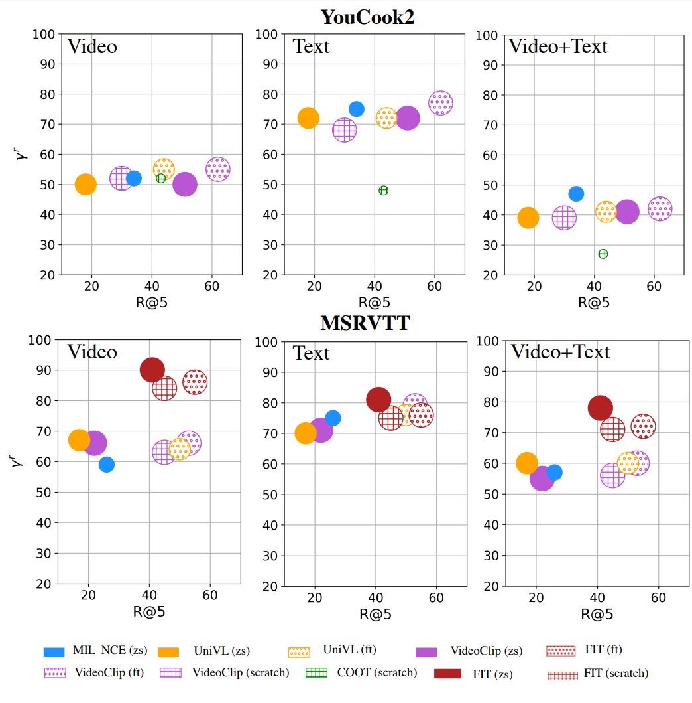
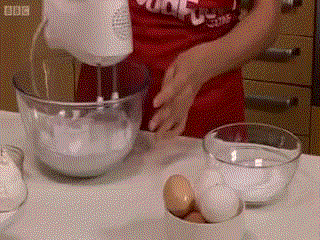
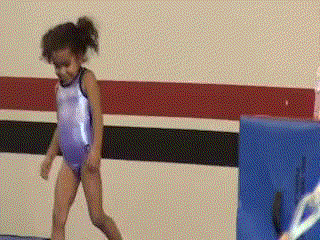
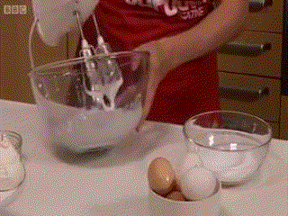
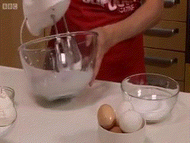
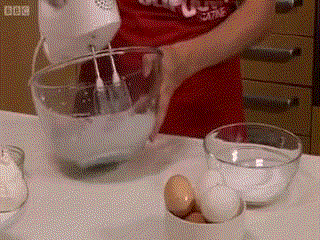
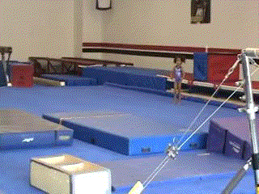
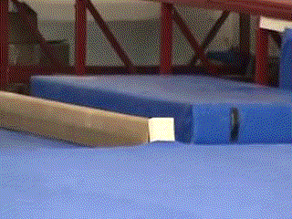
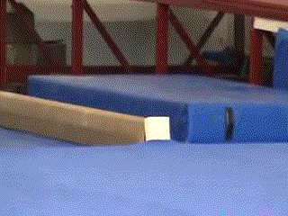

# MultiModalRobustness
 <center></center> <br>
    <center>Different real-world perturbations used in this study. </center>

## Text Perturbations
To genearate text perturbations, code is available in `generate_noisy_text.py`. 
You can call this script from the command line, for example:

```bash
python generate_noisy_text.py msrvtt --meta_pth msvrtt_eval.csv --text_style --textflint
```
This will call perturbations to run for those generated by the TextStyle and TextFlint packages for the 
MSRVTT dataset using the csv file that has (at minimum) columns for video_id and text. 

This is the same procedure for the MC VideoQA on MSRVTT in `generate_noisy_mc_videoqa.py`

## Video Perturbations
We provide both the on-the-fly generation of perturbations in `video_perturbations.py` which is useful for processing 
pre-extracted features and generating noisy video copies in `generate_noisy_videos.py`.

To run `generate_noisy_videos.py`, an example is:

```bash
python generate_noisy_videos.py msrvtt data/msrvtt/videos data/msrvtt/noisy_videos blur
```
This will run generating videos for MSRVTT where the original videos are stored in `data/msrvtt/videos`, perturbing with
blur and saving the copies in `data/msrvtt/noisy_videos`.

Use `video_perturbations.py` by creating a `VideoPerturbation` object by initializing the perturbation and severity.
This is useful when modifying video feature extractor code from 
[fairseq](https://github.com/facebookresearch/fairseq/tree/main/examples/MMPT/scripts/video_feature_extractor)
and [VideoFeatureExtractor](https://github.com/ArrowLuo/VideoFeatureExtractor/).


## Results
  <table align=center width=800px>
    <center></center><br>
    <center>A performance and robustness visualization of multimodal models on YouCook2-P and MSRVTT-P. 
      y-axis: relative robustness (lower is better), x-axis: R@5 on text-to-video retrieval,  
      , and the size of circle indicates FLOPs. The models used are 
      <a href="https://github.com/facebookresearch/fairseq/tree/main/examples/MMPT">Videoclip</a>,
      <a href="https://github.com/microsoft/UniVL">Univl</a>,
      <a href="https://github.com/gingsi/coot-videotext">COOT</a>, and
      <a href="https://github.com/antoine77340/MIL-NCE_HowTo100M">HowTo100M MIL</a>.
      The results vary based on the dataset, 
      for example, 
<a href="https://github.com/facebookresearch/fairseq/tree/main/examples/MMPT">Videoclip</a> from scratch is both more robust and a better performer on 
      the MSRVTT dataset than on YouCook2. This relationship <i>indicatea a difference on
      how models <b>handle clips from long, complex activities</b> compared to videos that 
      are short and of a simple activity</i>.
      The top performers are consistently <a href="https://github.com/facebookresearch/fairseq/tree/main/examples/MMPT">Videoclip</a>
      and <a href="https://github.com/microsoft/UniVL">Univl</a>, which are also the larger 
      models. </center>
  </table>


## Examples
<center><h3>Original</h3></center><br>
<p float="center">
    
      
</p>

<center><h3>Freeze (Temporal)</h3></center><br>
<p float="left">
    
      
      
      
      
</p>
<p float="left">
    
      
      
      
      
</p>

<center><h3>Box Jumble (Temporal)</h3></center><br>
<p float="left">
    
      
      
      
      
</p>
<p float="left">
    
      
      
      
      
</p>

<center><h3>Reverse (Temporal) </h3></center><br>
<p>

      
      
      
      
</p>
<p>

      
      
      
      
</p>


<center><h3>Impulse (Noise)</h3></center><br>
<p>
    
      
      
      
      
</p>
<p>
    
      
      
      
      
</p>


<center><h3>Rotate (Camera) </h3></center><br>
<p>

      
      
      
      
</p>
<p>

      
      
      
      
</p>

<center><h3>Motion Blur (Blur) </h3></center><br>
<p>

      
      
      
      
</p>
<p>

      
      
      
      
</p>